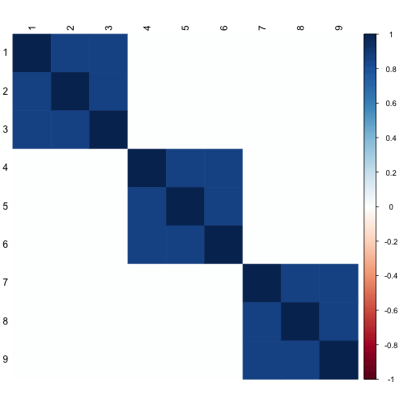
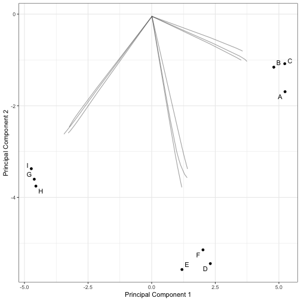
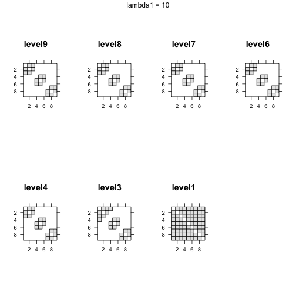

## Method 

This repository provides an implementation of the `MGLasso` (Multiscale Graphical Lasso) algorithm: an approach for estimating sparse Gaussian Graphical Models with the addition of a group-fused Lasso penalty. 

`MGLasso` is described in the paper [Inference of Multiscale Gaussian Graphical Model](https://desanou.github.io/multiscale_glasso/). `MGLasso` has these contributions:

-   We simultaneously infer a network and estimate a clustering structure by combining the [neighborhood selection](https://arxiv.org/abs/math/0608017) approach (Meinshausen and Bühlman, 2006) and [convex clustering](https://www.di.ens.fr/~fbach/419_icmlpaper.pdf) (Hocking et al. 2011).

-   We use a continuation with Nesterov smoothing in a shrinkage-thresholding algorithm ([`CONESTA`](https://arxiv.org/abs/1605.09658), Hadj-Selem et al. 2018) to solve the optimization problem.

To solve the `MGLasso` problem, we seek the regression vectors $\beta^i$ that minimize   

$J_{\lambda_1, \lambda_2}(\boldsymbol{\beta}; \mathbf{X} ) = 
  \frac{1}{2} 
     \sum_{i=1}^p 
        \left \lVert 
            \mathbf{X}^i - \mathbf{X}^{\setminus i} \boldsymbol{\beta}^i 
        \right \rVert_2 ^2  + 
  \lambda_1 
    \sum_{i = 1}^p  
      \left \lVert 
         \boldsymbol{\beta}^i \right \rVert_1 + 
  \lambda_2 
     \sum_{i < j} 
        \left \lVert 
           \boldsymbol{\beta}^i - \tau_{ij}(\boldsymbol{\beta}^j) 
        \right \rVert_2.$

`MGLasso` package is based on the python implementation of the solver `CONESTA` available in [pylearn-parsimony](https://github.com/neurospin/pylearn-parsimony) library.


## Package requirements and installation 

-   Install the `reticulate` package and Miniconda if no conda distribution available on the OS.


```r
install.packages('reticulate')
reticulate::install_miniconda()
```

-   Install `MGLasso`, its python dependencies and configure the conda environment `rmglasso`.

```r
# install.packages('mglasso')
remotes::install_github("desanou/mglasso")
```

```r
library(mglasso)
install_pylearn_parsimony(envname = "rmglasso", method = "conda")
#> + '/Users/doedmond.sanou/Library/r-miniconda/bin/conda' 'install' '--yes' '--name' 'rmglasso' 'python=3.8'
reticulate::use_condaenv("rmglasso", required = TRUE)
reticulate::py_config()
#> python:         /Users/doedmond.sanou/Library/r-miniconda/envs/rmglasso/bin/python
#> libpython:      /Users/doedmond.sanou/Library/r-miniconda/envs/rmglasso/lib/libpython3.8.dylib
#> pythonhome:     /Users/doedmond.sanou/Library/r-miniconda/envs/rmglasso:/Users/doedmond.sanou/Library/r-miniconda/envs/rmglasso
#> version:        3.8.13 | packaged by conda-forge | (default, Mar 25 2022, 06:05:47)  [Clang 12.0.1 ]
#> numpy:          /Users/doedmond.sanou/Library/r-miniconda/envs/rmglasso/lib/python3.8/site-packages/numpy
#> numpy_version:  1.22.4
#> conesta_solver: [NOT FOUND]
#> 
#> NOTE: Python version was forced by use_python function
```
The `conesta_solver` is delay loaded. See `reticulate::import_from_path` for details.


An example of use is given below.

## Illustration on a simple model  

### Simulate a block diagonal model   

We simulate a $3$-block diagonal model where each block contains $3$ variables. The intra-block correlation level is set to $0.85$ while the correlations outside the blocks are kept to $0$.  

```r
library(Matrix)
n = 50
K = 3
p = 9
rho = 0.85
blocs <- list()

for (j in 1:K) {
  bloc <- matrix(rho, nrow = p/K, ncol = p/K)
  for(i in 1:(p/K)) { bloc[i,i] <- 1 }
  blocs[[j]] <- bloc
}

mat.correlation <- Matrix::bdiag(blocs)
corrplot::corrplot(as.matrix(mat.correlation), method = "color", tl.col="black")
```



#### Simulate gaussian data from the covariance matrix   


```r
set.seed(11)
X <- mvtnorm::rmvnorm(n, mean = rep(0,p), sigma = as.matrix(mat.correlation))
colnames(X) <- LETTERS[1:9]
```

### Run `mglasso()`

We set the sparsity level $\lambda_1$ to $0.2$ and rescaled it with the size of the sample.


```r
X <- scale(X)    
res <- mglasso(X, lambda1 = 0.2*n, lambda2_start = 0.1, fuse_thresh = 1e-3, verbose = FALSE)
```

To launch a unique run of the objective function call the `conesta` function. 

```r
temp <- mglasso::conesta(X, lam1 = 0.2*n, lam2 = 0.1)
```

#### Estimated clustering path   
We plot the clustering path of `mglasso` method on the 2 principal components axis of $X$. The path is drawn on the predicted $X$'s.

```r
library(ggplot2)
library(ggrepel)
mglasso:::plot_clusterpath(as.matrix(X), res)
```



#### Estimated adjacency matrices along the clustering path   
As the the fusion penalty increases from `level9` to `level1` we observe a progressive fusion of adjacent edges.  

```r
plot_mglasso(res)
```



## Reference

Edmond, Sanou; Christophe, Ambroise; Geneviève, Robin; (2022): Inference of Multiscale Gaussian Graphical Model. ArXiv. Preprint. <https://doi.org/10.48550/arXiv.2202.05775>
